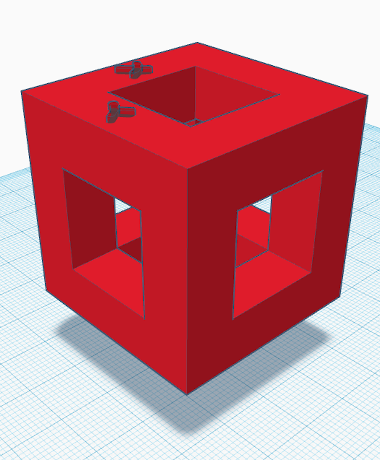
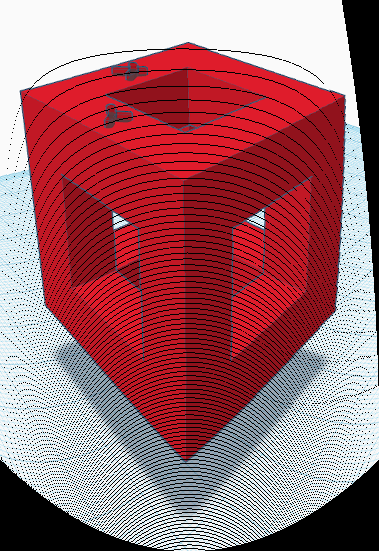
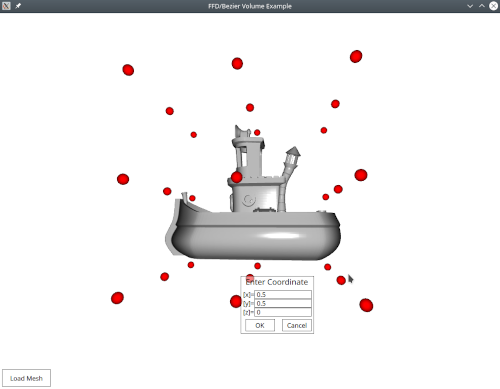
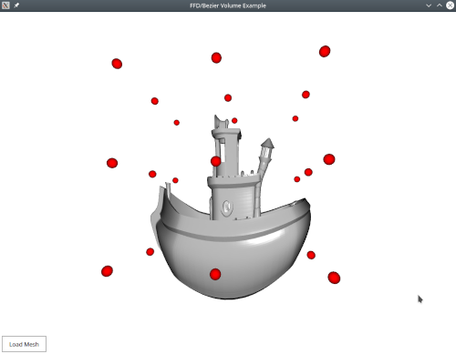

# A static C++17 bezier function generator

This lib can be used to generate arbitrary bezier functions (e.g. for free form deformations).
The function generation is static (happens at compile time). The end result is an optimized function. 

## Introduction

The bezier function template is a variadic. It expects a list of integers, 
which defines the bernstein polynomials used in the generated bezier function.

```cpp
bezier<x, y, z, ...>(in_position, in_control_points)
```

The number of template parameters also defines the dimension of the control point array **in_control_points**. 
If you work with images, you will have two template parameters and a 2D control point array.
If you work with 3D meshes, you will have three template parameters and a 3D control point array.
The value of the template parameters **x**, **y**, **z**, .. is the number of control points per dimension (row, column, ..) in **in_control_points**.

### Parameters
The function itself expects two input parameters

**in_position**: A vector with dimension equal to the number of template parameters (e.g. glm::vec, or an vector/array type). The values of the vector must be within 0 < x < 1. 

**in_control_points**: A control point array (with a dimension equal to the number of template parameters) holding vectors with a dimension equal to the number of template parameters

    
### Return
The function returns a vector with dimension equal to the input. 

## Build

The library itself requires **C++17**. The demos **Qt5**, **QtQuick** and **Qt3D**.

```
cd StaticBezier
mkdir build
cmake ..
make
```

## Demos

All demos are included as subfolders within the project's root directory.

### Image Manipulation - 3x3 control points for 2D image manipulation

Small demo to perform a free form deformation on an image.
Note that the black lines in the output are just resampling artifacts.

```cpp
int w = img.width();
int h = img.height();
std::map<std::array<float, 2>, QRgb> transf_img_arr;

std::array<glm::vec2, 3> a1 = { glm::vec2(0.0, 0.0), glm::vec2(0.0, 0.5), glm::vec2(0.0, 1.0) };
std::array<glm::vec2, 3> a2 = { glm::vec2(0.5, 0.0), glm::vec2(0.5, 0.5), glm::vec2(0.5, 1.4) };
std::array<glm::vec2, 3> a3 = { glm::vec2(0.9, 0.0), glm::vec2(1.0, 0.5), glm::vec2(1.0, 1.0) };
std::array<std::array<glm::vec2, 3>, 3> ctrl2d = { a1, a2, a3 };

// scaling, ffd, boundary estimation
float mx(-FLT_MAX), my(-FLT_MAX);
for(int i = 0; i < w; i++)
for(int j = 0; j < h; j++) {
    glm::vec2 t = bezier<3,3>(glm::vec2((float)i/w, (float)j/h), ctrl2d) * glm::vec2(w, h);
    transf_img_arr[{t.x, t.y}] = img.pixel(i, j);
    mx = mx < t.x ? t.x : mx;
    my = my < t.y ? t.y : my;
}
```

|Image Before        |Image After           | 
|:-------------------|:---------------------|
|  |   |


### QML Demo: FFD on *.stl files

The demo shows how to use the template to generate a function for a 3x3x3 control point grid to deform 3D-meshes.

|Mesh Before FFD     |Mesh After FFD        | 
|:-------------------|:---------------------|
|  |   |


